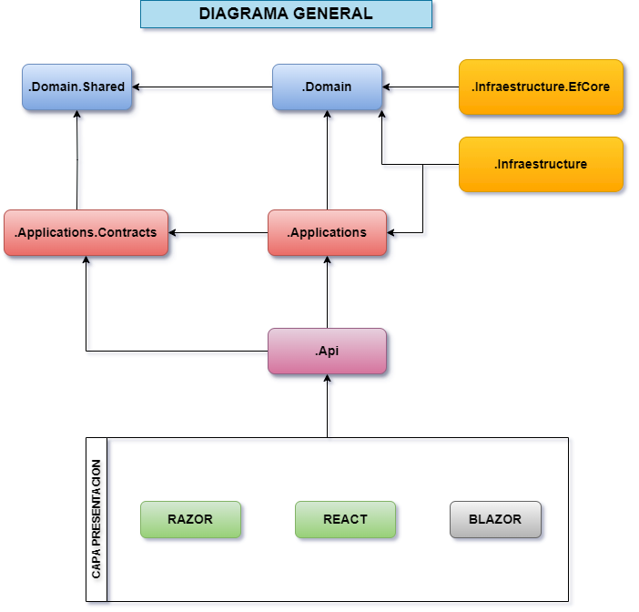

# Diagrama de Capas

Esta plantilla proporciona una estructura de aplicación en capas basada en las prácticas de diseño controlado por dominio (DDD).
Los proyectos se organizan en carpetas src. La carpeta contiene la aplicación real que está en capas según los principios de DDD como se mencionó anteriormente. Los proyectos de test estan dentro de la carpeta test.
Este documento explica en detalle la estructura de la solución y los proyectos de Makers. 
Utilizaremos una entidad de tipo Book, para entender los conceptos fundamentales.

:::tip Proyecto de Referencia (En desarrollo)
[Makers Referencia](https://dev.azure.com/makersfunds/_git/MakersArchitecture)
:::

# **Capa de Aplicacion**
---

## Makers.MyModule.Application.Contracts
Este proyecto contiene principalmente interfaces de servicios de aplicaciones y objetos de transferencia de datos (DTO) de la capa de aplicación. 
Existe para separar la interfaz y la implementación de la capa de aplicación. 
De esta manera, el proyecto de interfaz se puede compartir con los clientes como un paquete de contrato.
Interfaces externas, y Excepciones a nivel de aplicacion, son candidatas.

Una interfaz **IBookAppService** y una clase **BookCreationDto** son buenos candidatos para este proyecto.

Depende de .Domain.Shared porque puede usar constantes, enumeraciones y otros objetos compartidos de este proyecto en las interfaces de servicio de la aplicación y DTO.

## Makers.MyModule.Application
Este proyecto contiene las implementaciones de servicios de aplicaciones de las interfaces definidas en el proyecto.
**.Application.Contracts** asi como casos de Uso, Comandos,Queries, 

Un **BookAppService** clase es un buen candidato para este proyecto.

:::info MAS INFORMACION
* [Mas Info](./application.mdx)
* [Applicacion Services](/docs/ddd/services.md#servicios-de-aplicacion)
:::

## Makers.MyModule.Api
Este proyecto se utiliza para definir sus controladores API.
Es decir contiene los endpoint con los cuales se interactua la aplicación desde fuera.

### Dependencias
Depende del proyecto **.Application.Contracts** para poder inyectar las interfaces de servicio de la aplicación.
Comparte las interfaces Dto(Request,Response), con la aplicacion cliente.(React,Razor)

### Dependencias 
* Depende del proyecto **.Application.Contracts** para poder implementar las interfaces y utilizar los DTO.
* Depende del proyecto **.Domain** poder utilizar objetos de dominio 
(entidades, interfaces de repositorio... etc.) para realizar la lógica de la aplicación.

# **Capa de Dominio**
---

## Makers.MyModule.Domain.Shared
Este proyecto contiene constantes, enumeraciones, custom Exceptions, y otros objetos que en realidad forman parte de la capa de dominio, pero deben ser utilizados por todas las capas/proyectos de la solución.

Una enumeracion del tipo **BookType** y una clase **BookConsts** (que pueden tener algunos campos constantes para la entidad Book, como MaxNameLength) son buenos candidatos para este proyecto.

### Dependencias
* Este proyecto no depende de otros proyectos de la solución. Todos los demás proyectos dependen de éste directa o indirectamente.

## Makers.MyModule.Domain
Esta es la capa de dominio de la solución. Contiene principalmente entidades, agregados , servicios de dominio , objetos de valor (record), eventos , interfaces de repositorio y otros objetos de dominio.

Una Entidad **Book**, un domain service como un **BookManager** de dominio y un IBookRepository son buenos candidatos para este proyecto.

Los objetos de Domain Services, se suelen llamar services en marcos de trabajo como SpringBoot, u otros le suele llamar BusinessObjects un concepto acuñado Rockford Lhotka's de su libro Expert C# 2008 Business Objects. Nosotros les llamaremos Manager, porque tiene a realizar funciones de orquestacion y worflow.

Si el proyecto crece podria llegar a divirse en estos subproyectos como
* NotificationCenter.Domain.Entities
* NotificationCenter.Domain.Services
* NotificationCenter.Domain.Repositories

* Si no es un proyecto muy grande estas podria estar dentro de Domain, dividas en carpetas
* \Entities, \Services , \ Repositories

### Dependencias
* Este proyecto Depende de **.Domain.Shared** porque utiliza constantes, enumeraciones y otros objetos definidos en ese proyecto.

:::info MAS INFORMACION
* [Dominio](./domain.mdx)
* [Domain Services](docs/ddd/services.md#domain-services)
* [Domain Events](docs/ddd/events.md)
:::

# **Capa de Infraestructura**
---
## Makers.MyModule.Infraestructure.EfCore
Este es el proyecto de integración para EF Core. Define DbContext e implementa las interfaces de repositorio definidas en el 
proyecto **.Domain**

Este proyecto solo está disponible si usa EF Core como proveedor de base de datos.
Si selecciona otro proveedor de base de datos, su nombre será diferente.
Ejmp: Makers.NotificationCenter.Infraestructure.DynamoDb

### Dependencias 
Depende del proyecto **.Domain** poder hacer referencia a entidades e interfaces de repositorio.

## Makers.MyModule.Infraestructure

La capa de infraestructura ayuda a aislar los detalles específicos de la implementación tecnológica. 
Esto significa que las capas superiores de la aplicación, como la capa de dominio y la capa de aplicación, 
no necesitan preocuparse por los detalles de cómo se accede a los recursos de infraestructura, como la base de datos o los servicios externos. 
En su lugar, utilizan interfaces definidas por la capa de infraestructura para interactuar con estos recursos de manera transparente. 

Son candidatos para este proyecto, la autentificacion,autorizacion,email, cache
todo lo relacionado a la persistencia, aunque en este caso especifico existe un proyecto aparte.

Por tanto en este proyecto, podriamos esperar encontranos con implementaciones de:
* Clientes HTTP
* Almacenamiento en Nube o Local
* Proveedores de Identidad
* Brokers de Mensajerias
* Cache 

:::info MAS INFORMACION
* [Infraestructure](./infraestructure-efcore.mdx)
* [Infraestructure Services](docs/ddd/services.md#infraestructure-services)
:::
