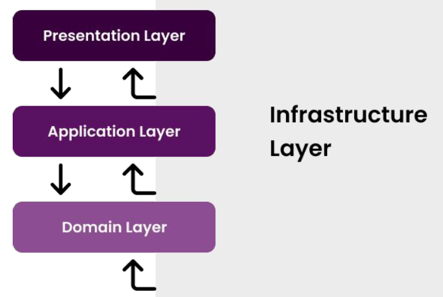
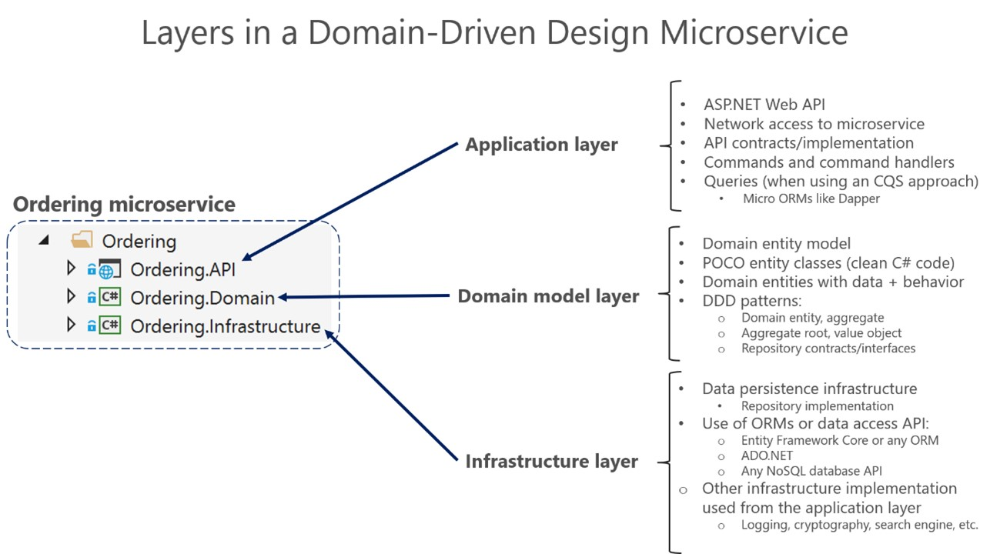
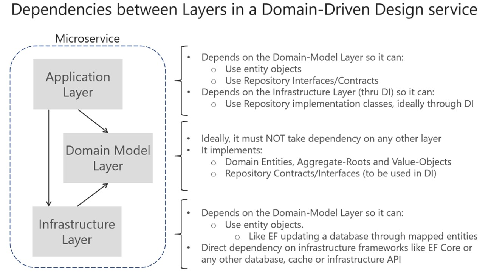

# Que es DDD

El Domain-Driven Design (DDD) no es una tecnología ni una metodología, sino una práctica de desarrollo de software con necesidades complejas, que sitúa el Dominio del Negocio como faro del proyecto y en su Modelo, como herramienta de comunicación entre negocio y tecnología.

[Diseño de un microservicio orientado a DDD](https://learn.microsoft.com/es-es/dotnet/architecture/microservices/microservice-ddd-cqrs-patterns/ddd-oriented-microservice)

Existen 4 capas fundamentales en DDD

La logica del negocio se divide en dos capas, la capa de dominio y la capa de aplicación, aunque contienen diferentes tipos de
lógica de negocios.

En la Arquitectura Limpia, cada capa solo depende de la capa directamente dentro de él. La capa más independiente se muestra en la
el círculo más interno y es la capa de dominio.

:::tip DDD
En 2003, Eric Evan publicó su libro titulado “Tackling Complexity in the Heart of Software”, en el cual laza los primeros conceptos de DDD (Domain-Driven Design), aumentando su popularidad de manera exponencial desde entonces.
:::

## Capa de Aplicación
El nivel de aplicación define los trabajos y tareas que se supone que debe hacer el software y dirige los objetos de dominio expresivo para que resuelvan problemas.

## Capa de Dominio
El nivel de modelo de dominio es el nivel responsable de representar conceptos del negocio, información sobre la situación del negocio y reglas de negocios.

## Capa de Infraestructura
La capa de infraestructura contiene todos los componentes que proporcionan los recursos y servicios que la aplicación necesita para funcionar. Estos recursos y servicios pueden incluir sistemas de almacenamiento de datos, servidores de correo electrónico, sistemas de autenticación y otros sistemas de terceros.

