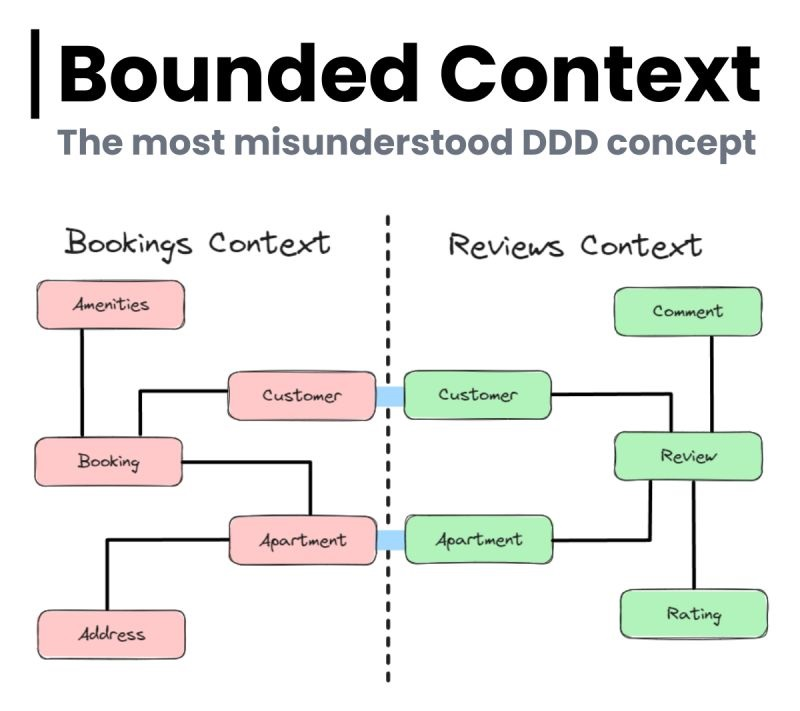

# Bounded Context
Los contextos delimitados consisten en dividir un sistema grande en partes más pequeñas y manejables, cada una de ellas con modelos y conjuntos de reglas distintos. 
Los Bounded contexts delimitan áreas específicas dentro de un sistema en las que se aplica un lenguaje, un conjunto de reglas y unos modelos concretos. 
Es como crear una "frontera lingüística" para evitar ambigüedades.

A la hora de integrar Bounded Contexts es importante recordar que los mismos deben ser autónomos. Cada uno es desarrollado de forma independiente y aislada de los demás. Su codebase puede ser evolucionado sin miedo a romper funcionalidades de otro Bounded Context. No hay dependencias de código fuente entre Bounded Contexts. Creamos estos contextos para reducir la complejidad de nuestro sistema y poder entregar valor de negocio rápidamente, por ende es muy importante intentar respetar su autonomía.
Por eso es que, estos contexto delimitados pueden servir de base para monolitos modulares, o una arquitectura de microservicios.

:::tip MicroServicios
Si bien es cierto que en algunas implementaciones un bounded context puede coincidir con un microservicio, no son lo mismo. Un bounded context es más un concepto de diseño de dominio y arquitectura de software, mientras que un microservicio es una forma de implementar esa arquitectura, donde un bounded context puede ser una unidad lógica dentro de un microservicio o puede estar dividido en múltiples microservicios, dependiendo de la complejidad del dominio y los requisitos del sistema
:::

**Ejemplo** : En un sistema de comercio electrónico, el contexto de “Order Management" puede tener reglas y modelos diferentes que el contexto de “Shipping".

