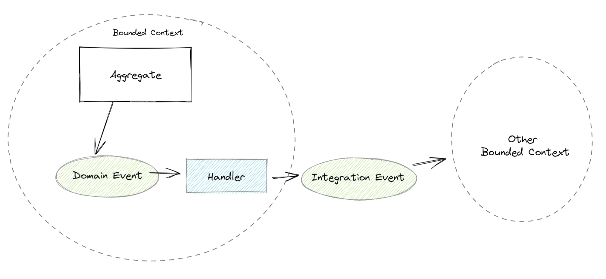

# Eventos

Los eventos son grandes ordenadores de los procesos de negocio y permiten descubrir y entender flujos complejos que involucran a distintos actores. 
Algunas tecnicas como Event Storming se basan en focalizarse en los principales eventos que ocurren en una empresa.

Los eventos pueden clasificarse en Eventos de Dominio o Eventos de Integracion. La principal diferencia entre ambos es su contexto.

## Eventos de Dominio
Los eventos de dominio son un excelente patrón para desacoplar un desencadenante de una operación de su implementación. Esto es especialmente útil dentro de las entidades del dominio, ya que los controladores de eventos pueden tener dependencias, mientras que las entidades mismas normalmente no las tienen.

:::tip Evento de Dominio
Los eventos de dominio (Domain Events) son uno de los patrones de diseño tácticos de Domain Driven Design (DDD).
:::

Es importante notar que los eventos de dominio no son cuestiones técnicas (por ejemplo que se persistió una entidad o se clickeo un botón) sino que son conceptos del negocio. Nos permiten enriquecer nuestro modelo y el lenguaje ubicuo incorporando hechos.
Los eventos de dominio siempre son internos a un Bounded Context. Son parte de un modelo y de su lenguaje ubicuo. Cada Bounded Context implementa su propio modelo y lenguaje por ende tendrá sus propios eventos.

## Eventos de Integracion
Un evento de integracion, por el contrario es externo a su contexto delimitado.

A la hora de integrar Bounded Contexts es importante recordar que los mismos deben ser autónomos. Cada uno es desarrollado de forma independiente y aislada de los demás. Su codebase puede ser evolucionado sin miedo a romper funcionalidades de otro Bounded Context. No hay dependencias de código fuente entre Bounded Contexts. Creamos estos contextos para reducir la complejidad de nuestro sistema y poder entregar valor de negocio rápidamente, por ende es muy importante intentar respetar su autonomía.

