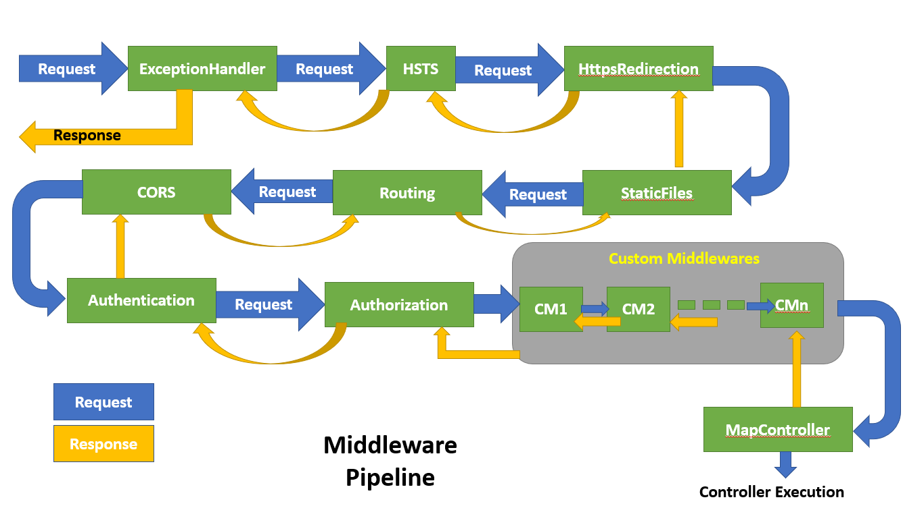

# Patron Mediator

Es un patrón de diseño de software de comportamiento que lo ayuda a crear un código más simple al hacer que todos los componentes se comuniquen a través de un objeto "mediador", en lugar de hacerlo directamente entre sí. Esto ayuda a que el código permanezca altamente desacoplado y reduce la cantidad de dependencias complejas entre objetos.

:::tip Mediator
Mas informacion del Patron en [Mediator](https://refactoring.guru/es/design-patterns/mediator)
:::

## Implementacion Makers
:::info
Para Implementar dicho patron hacemos uso de la libreria
[MediatR](https://github.com/jbogard/MediatR)
:::

### Registramos los Servicios del Mediador
```cs title="Startup.cs"
 public void ConfigureServices ( IServiceCollection services ) { 
 // other services 
 services.AddMediatR( typeof (Startup)); 
 }
```
### Envio Solicitudes
Para enviar solicitudes debemos crear dos objetos, uno la solicitud y otro
el controlador de solicitudes.
El objeto Solicitud, debera implementar las Intefaces **IRequest** o bien **IRequest< TResponse >**
La primera interfaz es cuando no se retorna un resultado, y la segunda es cuando se retorna algun valor.
```cs title="AdditionRequestHandler.cs"
public class AdditionRequestHandler : IRequestHandler<AdditionRequest,int> { 
    public Task<int> Handle(AdditionRequest request, CancellationToken cancellationToken) { 
    var result = request.A + request.B; return Task.FromResult(result);
 }}
```

* Luego se envia la solicitud mediante MediatR
```cs title="Calculator.cs"
public class Calculator { 
    private readonly IMediator _mediator; 
    public Calculator ( IMediator mediator ) {
     _mediator = mediator; 
     } 
     public async Task< int > Add ( int a, int b ) { 
         var request = new AdditionRequest { A = a, B = b }; 
         var result = await _mediator.Send(request); 
         return result; 
     } 
}
```

### Envio de Notificaciones
El envío de notificaciones es muy similar al envío de solicitudes, en el sentido de que se debe crear un objeto de notificación y un objeto de controlador de notificaciones. 
La diferencia aquí es que se pueden crear múltiples objetos del controlador de notificaciones, que se llamarán cuando se envíe una notificación a MediatR.

```cs title="Notificacion.cs"
public class MyNotification : INotification { 
// Propiedades de la Notificacion
} 

public class NotificationHandler : INotificationHandler<MyNotification> 
{
     public Task Handle ( MyNotification notification, CancellationToken cancellationToken ) { // do stuff return Task.CompletedTask; } } public class MyNotificationHandler2 : INotificationHandler < MyNotification > { public Task Handle ( MyNotification notification, CancellationToken cancellationToken ) 
     { 
      // procesamos o realizamos alguna tarea
       return Task.CompletedTask; 
     } 
 }
```

```cs title="AdditionRequestHandler.cs"
public class MyService { 
    private readonly IMediator _mediator; 
    public MyService ( IMediator mediator ) {
        _mediator = mediator; 
    } 
    public async Task Execute ( ) { 
        var notification = new MyNotification { // initialise }; 
        await _mediator.Publish(notification); //Notificamos
    } 
 }
```

### Canalizaciones (Pipes)
Los comportamientos de canalización son un tipo de middleware que se ejecuta antes y después de una solicitud (solo admite solicitudes, no notificaciones). 
Pueden ser útiles para una serie de tareas diferentes, como registro, manejo de errores, validación de solicitudes, etc.
En la Jerga de Mediat, a esto tipos de Midleware, suele llamarseles Behaviours.


```cs title="AdditionRequestHandler.cs"
public class LoggingBehavior<TRequest,TResponse> : IPipelineBehavior<TRequest,TResponse> 
{ 
    private readonly ILogger<LoggingBehavior<TRequest, TResponse>> _logger; 
    public LoggingBehavior(ILogger<LoggingBehavior<TRequest,TResponse>> logger )
    {
         _logger = logger; 
    } 
    public async Task<TResponse> Handle ( TRequest request, CancellationToken cancellationToken, RequestHandlerDelegate<TResponse> next ) 
    {
        _logger.LogInformation( $"Captura { typeof (TRequest).Name} " ); 
        // ir al siguiente comportamiento en la cadena de responsabilidades 
        var response = await next(); 
        _logger.LogInformation( $"Handled { typeof (TResponse).Name} " );
        return response; 
   }
}
```
