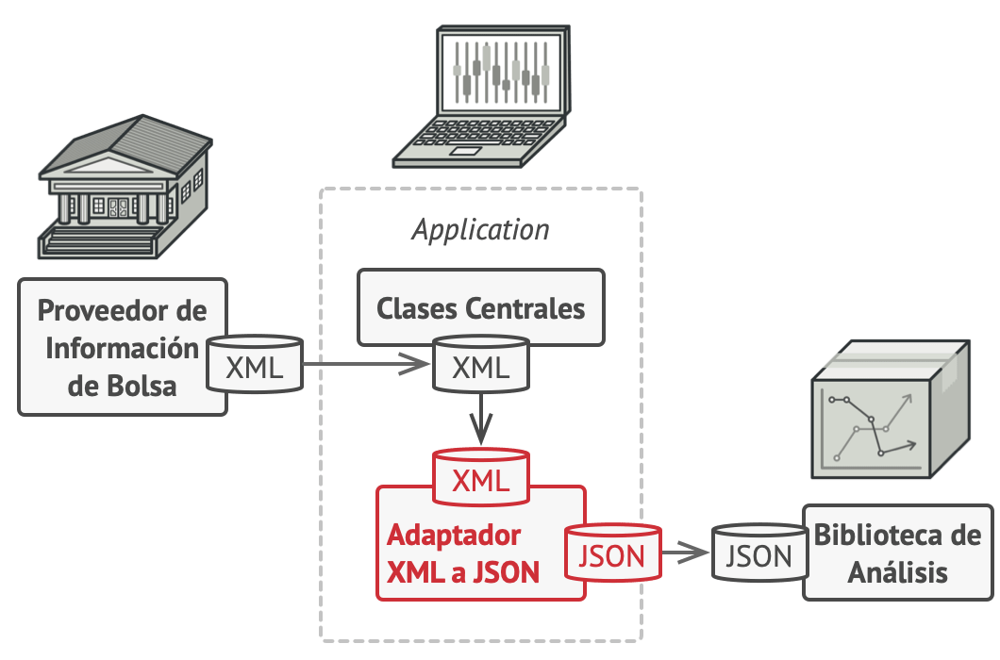

# Patron Adapter

El patrón **Adapter** es un patrón de diseño estructural que permite adaptar una interfaz existente a otra interfaz. 
En otras palabras, el adaptador actúa como un intermediario entre dos interfaces incompatibles y proporciona una capa adicional de abstracción 
para permitir que los objetos trabajen juntos.



[Mas Información del Patrón...](https://refactoring.guru/es/design-patterns/adapter)

## Ejemplo aplicado a Makers
Supongamos que necesitamos referirnos a una cola de mensajes que podria
estar implementada en Rabbit o bien AWS SQS.
Necesitamos enviar nuestro mensaje desde la capa de aplicación.

En la arquitectura limpia, también conocida como arquitectura hexagonal o arquitectura de puertos y adaptadores, 
la comunicación con elementos externos como colas de mensajes se gestiona a través de interfaces.

* Crea un interfaz en la capa de dominio

```cs title="IMessageQueueService.cs"
public interface IMessageQueueService
{
    void SendMessage(string message);
}
```

* Implementamos la Interfaz en la capa de Infraestructura, en este
caso realizamos una implementacion tanto para Rabbit como para AWS SQS.

```cs title="RabbitMQService.cs/AWSMQService.cs"
public class RabbitMQService : IMessageQueueService
{
   public void SendMessage(string message){}
}

public class AWSMQService : IMessageQueueService
{
   public void SendMessage(string message){}
}
```
* Por ultimo en la capa de aplicacion  utilizamos una
 implementacion concreta.

```cs title="BrokerAppService.cs"
public class BrokerAppService
{
    private readonly IMessageQueueService _messageQueueService;

    public BrokerAppService(IMessageQueueService messageQueueService)
    {
        _messageQueueService = messageQueueService;
    }

    public void SendMessageToQueue(string message)
    {
        _messageQueueService.SendMessage(message);
    }
}
```
